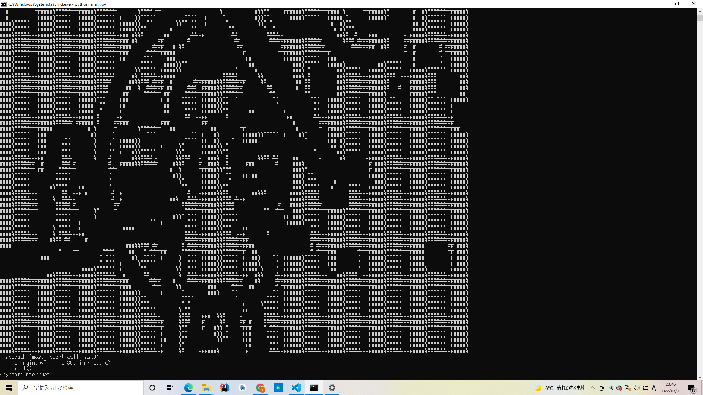

# bad-apple

実行環境 : windows

## セットアップ

1. `requirements.txt`のライブラリをインストール
2. ルートディレクトリに`sample.mp4`(Bad Apple)の動画を置く
3. `setup.py`を実行(`result_png`(画像をフレームごとに画像化), `result_png2`(result_png 内の画像を白黒化), `result_text`(ターミナルに出力される文字列ファイル)が生成される)
4. `run.py`を実行(ターミナルに Bad Apple が出力される)
